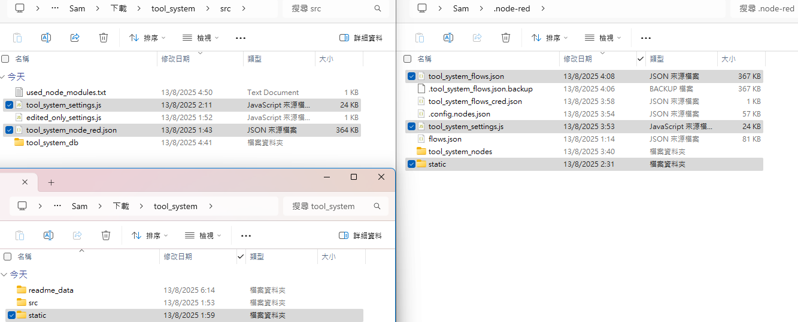

# Setup Database
Server > Data Import > Import from Dump Project Folder


find my database in `src` and copy path like `C:\Users\Sam\Downloads\tool_system\src\tool_system_db`


# install used node_modules
```shell
C:\Users\Sam> cd .node-red
C:\Users\Sam> mkdir tool_system_nodes
C:\Users\Sam> npm install --prefix tool_system_nodes @flowfuse/node-red-dashboard@1.13.0 @node-red-contrib-themes/theme-collection@4.0.7 @sumit_shinde_84/node-red-dashboard-2-ui-webcam@1.0.2 node-red-contrib-image-tools@2.1.1 node-red-contrib-mdashboard@0.1.17 node-red-contrib-ui-contextmenu@2.0.1 node-red-dashboard@3.6.5 node-red-node-mysql@2.0.0 node-red-node-ui-list@0.3.6 node-red-node-ui-table@0.4.3
```
```shell
C:\Users\Sam> npm install mysql
```
# Put files to .node-red dir (C:/Users/Sam/.node-red)
you can find: <br>
two files in `src` (in the img, `tool_system_node_red.json` is `tool_system_flows.json`,I will change the img later)<br>
and `static` in main dir
 

# run
```shell
node-red --settings .node-red/tool_system_settings.js
```

http://127.0.0.1/admin/ for node red editing

http://127.0.0.1/ for sign in

http://127.0.0.1/dashboard/page1 tool system ui (if the navigation broken)

